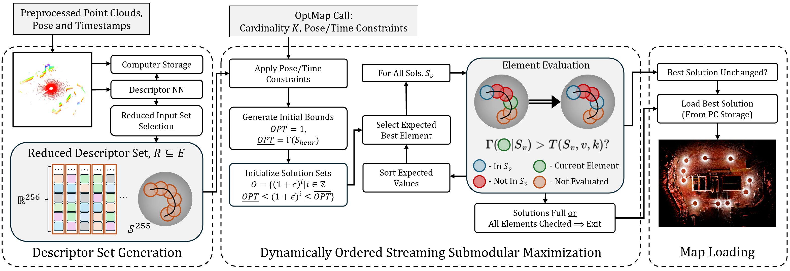
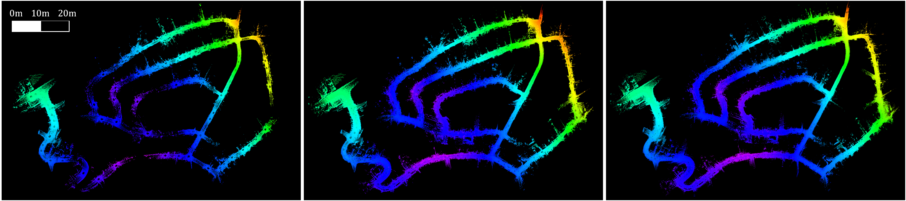
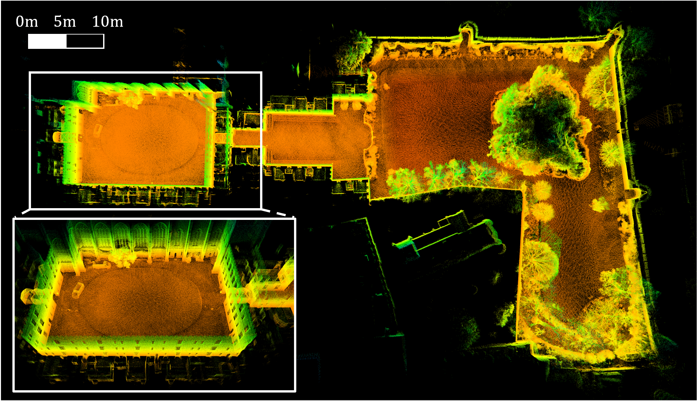
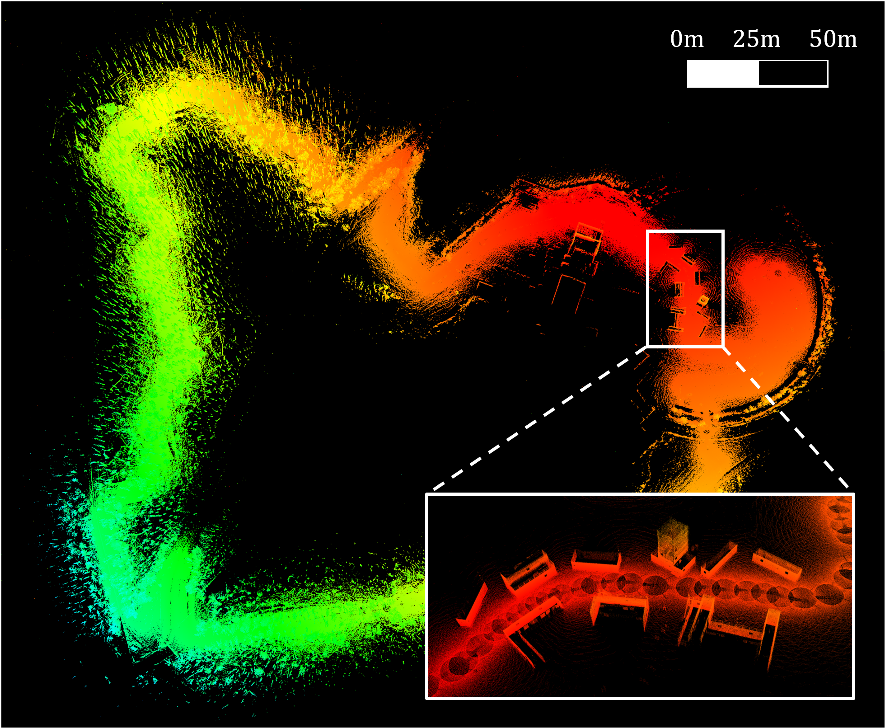

# OptMap
Real-time geometric map distillation for fast and flexible LiDAR map generation using streaming submodular maximization.

ROS2 code [here](https://github.com/vectr-ucla/optmap/tree/ros2).

<br>
<p align='center'>
    
</p>
<p align=center>OptMap pipeline with three stages, descriptor set generation, dynamically reordered streaming submodular maximization, and map loading.</p align=center>

## Dependencies
- Ubuntu 20.04
- ROS Noetic (`roscpp`, `std_msgs`, `sensor_msgs`, `geometry_msgs`, `nav_msgs`, `pcl_ros`)
- C++ 17
- CMake >= `3.12.4`
- OpenMP >= `4.5`
- Point Cloud Library >= `1.10.0`
- Eigen >= `3.3.7`

```
sudo apt install libomp-dev libpcl-dev libeigen3-dev
```

Python dependencies for the descriptor neural network are found in scripts/nn/pkg_install.txt. Instructions for installing pytorch found [here](https://pytorch.org/get-started/locally/) and instructions for installing nvidia drivers found [here](https://documentation.ubuntu.com/server/how-to/graphics/install-nvidia-drivers/).

Download weights for the descriptor neural network from [https://drive.google.com/file/d/1pry7TpMq2wzfnhBgmKWKNBYuHVmOs_jM/view?usp=sharing](https://drive.google.com/file/d/1pry7TpMq2wzfnhBgmKWKNBYuHVmOs_jM/view?usp=sharing) and save them to scripts/nn/.

## Overview
OptMap contains two nodes: the primary optmap node is a LiDAR mapping node which can be used to generate customized maps in real time, and the second generates point cloud descriptors which are used by the optmap node to select output maps. Both are launched from the same launch file `optmap.launch`.

## Setup
OptMap is meant to run alongside a LiDAR SLAM or odometry algorithm (ex. DLIO https://github.com/vectr-ucla/direct_lidar_inertial_odometry/tree/feature/optmap). Clone both OptMap and the LiDAR SLAM/odometry package into the same workspace. For interfacing, OptMap relies on two subscriptions from the SLAM/odometry package: (i) a point cloud with motion correction or any moving object filters applied (type sensor_msgs::PointCloud2) with points in a global frame and (ii) a corresponding scan pose with the scan index sent using a custom message type (OptMap::OptmapPose). The OptmapPose message contains a geometry_msgs::Pose which is the pose of the sensor when the scan was collected, and an integer which is equal to pointcloud->header.seq for the corresponding scan. Note that publishing sequential PointCloud2 messages autofills the pointcloud->header.seq field according to how many point clouds have been published on the topic.

See the modifications for DLIO at https://github.com/vectr-ucla/direct_lidar_inertial_odometry/tree/feature/optmap. Note that if the SLAM/odometry already uses custom ROS messages, the OptmapPose.msg file can be directly copied into its msg directory. If the SLAM/odometry does not use custom messages, the package will need to be modified to do so (https://wiki.ros.org/ROS/Tutorials/CreatingMsgAndSrv).

Once the OptMap pose topic is added to the SLAM/odometry pacakge, build both in the same workspace.

## Launching
Launching optmap requires providing the topics for the relevant publishers from the LiDAR SLAM/odometry package. Both nodes within OptMap are launched using the command:

```
roslaunch optmap optmap.launch
  pointcloud_topic:={PC_from_SLAM}
  pose_topic:={pose_from_SLAM}
```

## CLI Service Calls
Below are examples of how to call various optmap services using rosservice CLI:
```
rosservice call /optmap/optmap_node/optmap_set_voxelization 0.5
rosservice call /optmap/optmap_node/optmap_full "{num_scans: 5, output_folder: '/home/vectr', save_map: true, save_poses: true}"
rosservice call /optmap/optmap_node/optmap_position "{num_scans: 5, x: [0], y: [0], z: [0], r: [10], output_folder: '/home/vectr', save_map: true}"
rosservice call /optmap/optmap_node/optmap_position_and_time "{num_scans: 5, x: [0, -4, -12.2], y: [0, 2.5, 15], z: [0, 0, 0], r: [10, 2, 15], t1: [1749054988], t2: [1749055020], output_folder: '/home/vectr', save_map: true}"
```
Note that time constraints are in Unix time, and optmap saves scan timestamps according to the pointcloud timestamp by default.

## Loop Closure Corrections
Updating scan poses from SLAM loop closures is an important feature for a geometric mapping algorithm, note that implementation for loop closure corrections in OptMap currently only updates scan positions and not orientations. 

A loop closure correction can be sent to OptMap via the pose_update_topic which can be specified in the launch command by adding `pose_update_topic:={loop_closure_from_SLAM}`. The message type is OptMap::OptmapPoseArray.msg which contains a vector of OptmapPoses. We assume the loop closure uses the output of a factor or pose graph solve, where the new poses of those scans associated with the nodes of the graph should be sent. 

Development is currently under way on incorporating orientation updates.

<br>
<p align='center'>
    
</p>
<p align=center>Semantic KITII Sequence 02 summary maps with 100, 250, and 500 scans.</p align=center>

<br>
<p align='center'>
    
</p>
<p align=center>Newer College Dataset Long Experiment 250 scan summary map showcases significant level of detail made available by OptMap.</p align=center>

<br>
<p align='center'>
    
</p>
<p align=center>500 scan summary map of large custom forest loop dataset which traversed 2.3 km.</p align=center>
